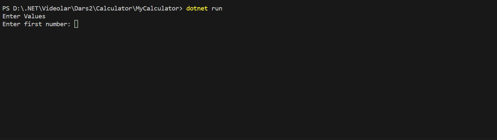
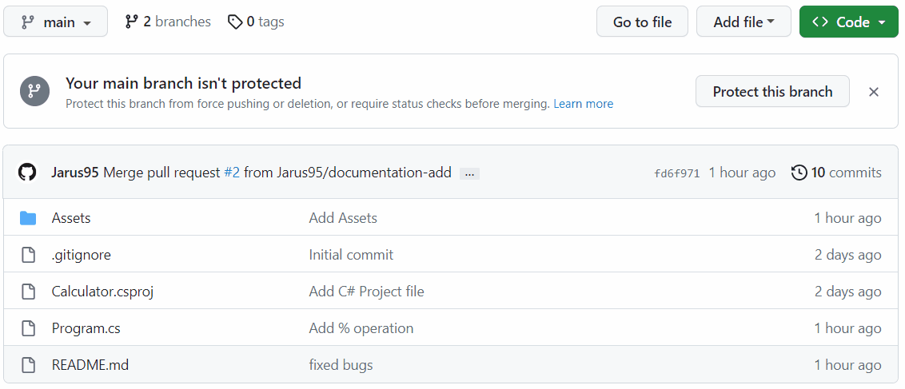
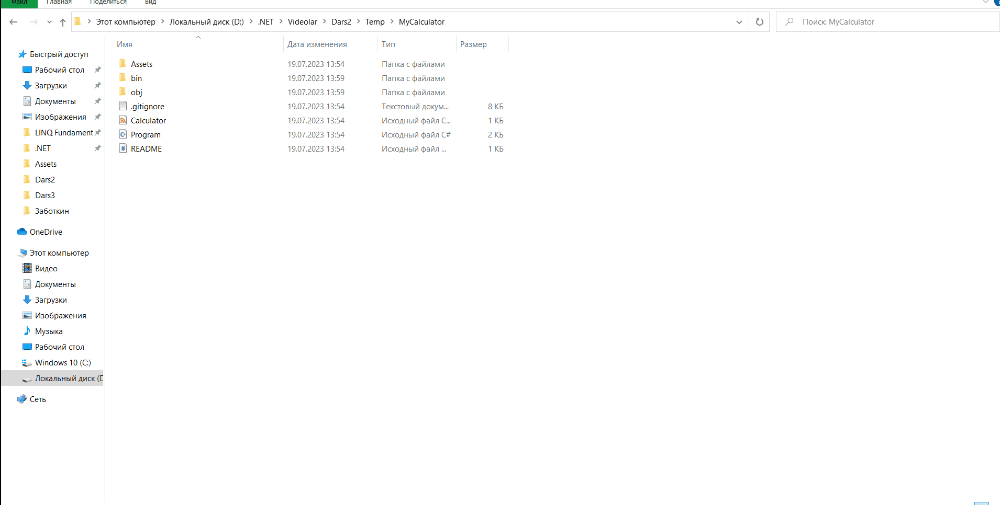

# MyCalculator

This project shows how I can successfully use data types &amp; arithmetic operations

Have a look at `Program.cs` file and you can see how I have used:

* Console input/output
* Conversion between data types
* Arithmetic operations

## Demo

## How to run locally
1. Press the green clone button and copy the git **[link](https://github.com/Jarus95/MyCalculator.git)**

2. Open your local folder and run terminal then enter the command *git clone **[link](https://github.com/Jarus95/MyCalculator.git)***

3. Open project and write _dotnet run_ command in terminal

