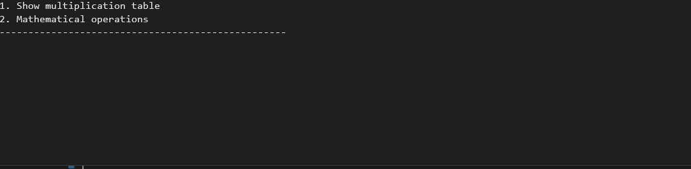

# MyCalculator v2.0

This is an improved version **[v1.0](https://github.com/Jarus95/Calculator/tree/releases/v1.0)**

This project shows how I can successfully use data types &amp; arithmetic operations

Have a look at `Program.cs` file and you can see how I have used:

* Console input/output
* Conversion between data types
* Arithmetic operations 
* Logical operation (if else, switch case expression)
* Loop operations
* The try-catch statement
* Classes
* Inheritence
* Polymorphism 
* Interfaces
## Demo

## Release Notes

### **[v3.0](https://github.com/Jarus95/Calculator/tree/releases/v3.0)**

#### New Features
* You can use Advanced Calculator ( √a, a^b )

### **[v2.0](https://github.com/Jarus95/Calculator/tree/releases/v2.0)**

#### New Features
* You can show multiplication table
* Program to ask you to try again
* Handle exceptions that might occur during execution

### **[v1.0](https://github.com/Jarus95/Calculator/tree/releases/v1.0)**

#### Features
* You can now add two numbers using the 

  **+ - / * %**  operators

## How to run locally
1. Press the green clone button and copy the git **[link](https://github.com/Jarus95/Averagely.git)**

2. Open your local folder and run terminal then enter the command *git clone **[link](https://github.com/Jarus95/Averagely.git)***

3. Open project and write _dotnet run_ command in terminal
